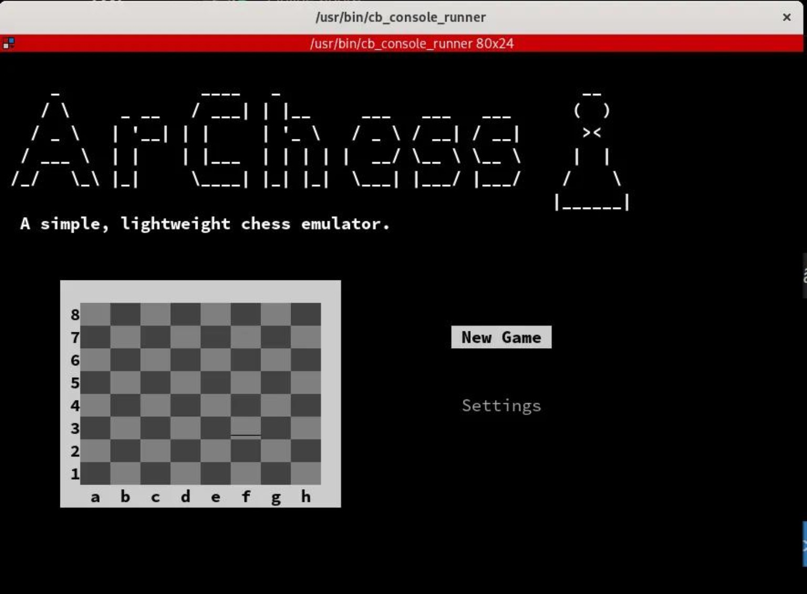
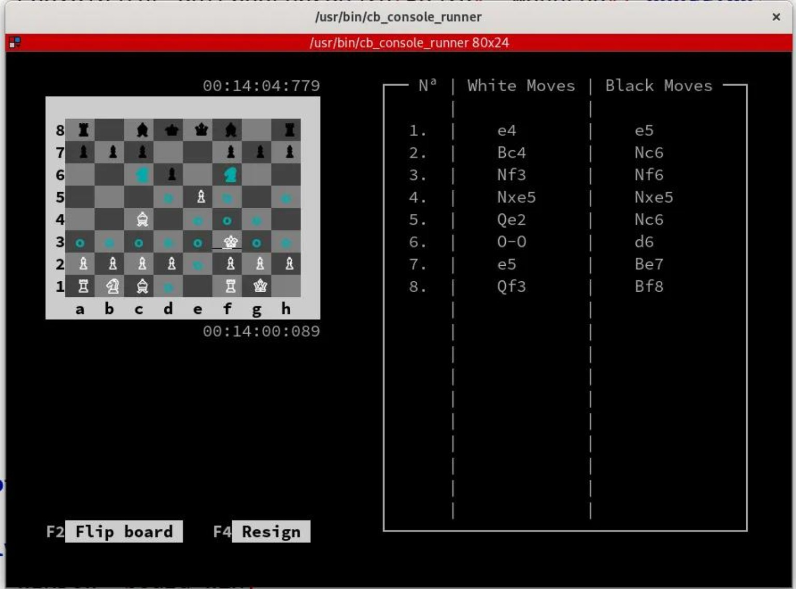
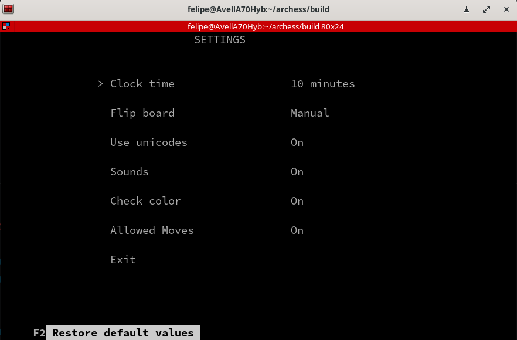

# Archess

A simple, lightweight chess game for the Linux terminal.

Archess is a long-term study project that began during my technical education and has continued to evolve as I learned new programming concepts. Instead of creating new projects for each topic I studied, I chose to continuously improve the same codebase through refactoring, redesigning its architecture, and implementing better software engineering practices.

The project serves not only as a playable chess game but also as a practical environment for studying object-oriented programming, software architecture, algorithms, data structures, and clean code principles.

---

## Technologies

- C++
- CMake
- ncurses
- Git

---

## Screenshots

### Main Menu



### Gameplay



### Settings



---

## Architecture

Archess was designed with a clear separation between the game engine and the user interface.

The chess logic is completely independent of the presentation layer. The current implementation uses an **ncurses**-based terminal interface, but thanks to polymorphism, new interfaces can be added without modifying the game engine.

This architecture makes it possible to develop alternative frontends such as:

- Desktop GUI
- Web application
- Mobile application
- Different terminal interfaces

while reusing the same chess engine.

---

## Building

```bash
git clone https://github.com/your-username/archess.git
cd archess

mkdir build
cd build

cmake ..
make
./Archess
```